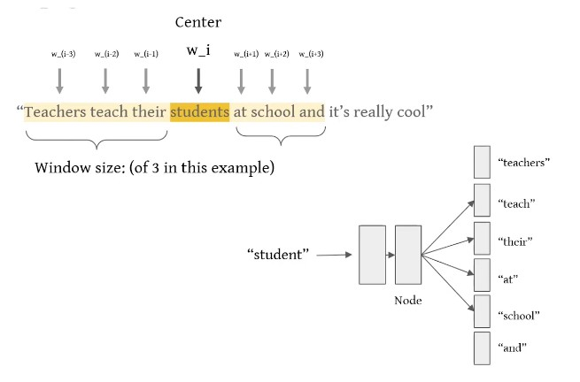
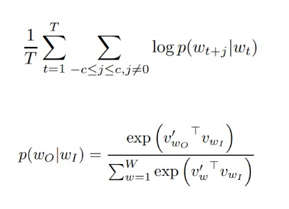
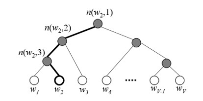
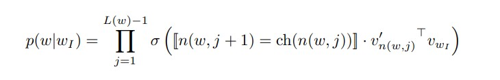
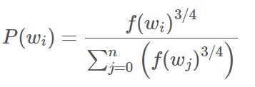
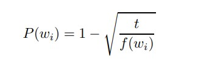
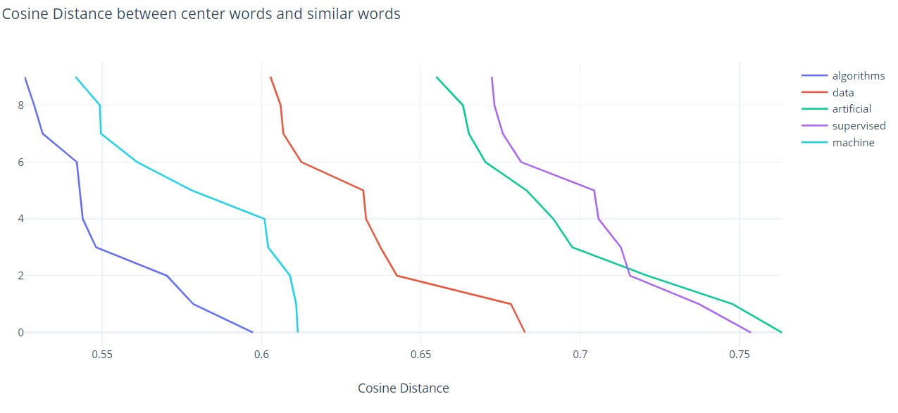
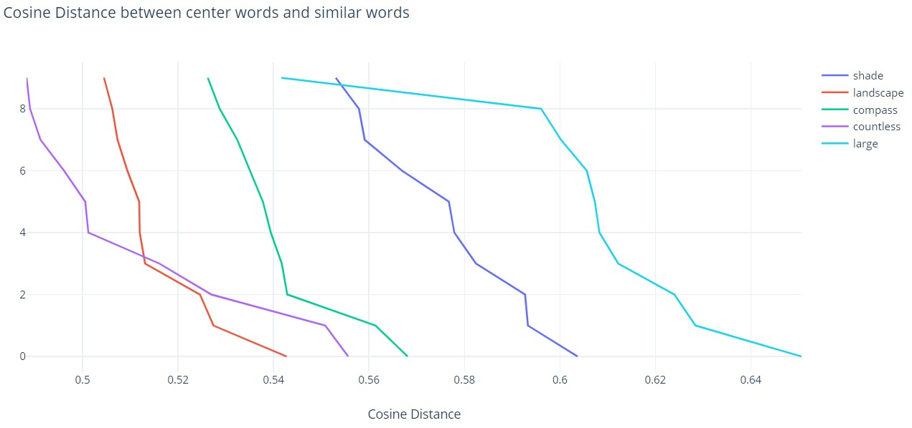

# CSDS 497 Final Project Individual Writeup

# Survey
For this project, I read the paper *"Distributed Representations of Words and Phrases and their Compositionality"* (Mikolov et. al. 2013).

## Distributed Representations of Words and Phrases and their Compositionality (Mikolov et. al. 2013)
In general, the word2vec algorithm uses a neural network model to learn word associations from a large corpus of text. Once trained, such a model can detect synonymous words or suggest additional words for a partial sentence. But how does Word2Vec do the task of generating vectors from the words? This is done primarily using two algorithms: Continuous bag of Words (CBOW) and Skip-Gram model. In the above mentioned paper, the authors (also Google NLP researchers) discusses the Skip-gram model in detail along with various extensions including subsampling, negative sampling etc. 

Skip-gram is a word2vec learning algorithm that efficicently produces vector representations. These vector representations, unlike one-hot encoding that identifies unique words for the computer and doesn’t provide any intrinsic meaning for the words, actually provide both syntactic and semantic relationships. 

The main objective of the Skip-gram model is to learn word vector representations that are good at predicting the context words, nearby a central word. For instance, consider following example. THe model takes the word “student” as the input (also called the center word), goes through the processing in the hidden layers and outputs  the probability distribution of the words surrounding the center word (also called the context words). The yelow highlight represents the window size on either side of the center word. This window size is a hyperparameter which could be tuned for the the model as needed. 

More formally, the objective of the Skip-Gram model is to maximize the following log probability:

However, the paper argues that this formulation is impractical because the cost of computing the above log propability is proportional to size of corpus which is often very large. THerefore, paper then presents two extensions to this model: Hierarchical Softmax and Negative Sampling (based on Noise Contrastive Estimation). 

As the Skip-gram model is a Neural network model, it uses softmax activation function to create the probability distribution along with the cross entropy for error calculation. The Hierarchical Softmax is basically a computationally efficient approximation of this softmax activation used by the model. The idea behind this extension is inspired by Binary Trees: Leaves represent probabilities of words such that leave with the index j has j-th position in the output softmax vector (as shown in the diagram below)
 The paper drew inspiration from the "Extensions of
recurrent neural network language model. In Acoustics, Speech and Signal Processing" (Tomas Mikolov, Stefan Kombrink, Lukas Burget, Jan Cernocky, and Sanjeev Khudanpur) and "Efficient estimation of word representations in vector space" (Tomas Mikolov, Kai Chen, Greg Corrado, and Jeffrey Dean) to argue that the this idea of using binary huffman tree and grouping words by their frequency results in faster training for the neural network models. In fact, in this case, the run time efficiency is drastically improved from linear to logarithmic of the size of corpus: O(W)  → O(log (W)). How? 
 The paper derives this as the formula for the Hierarchical Softmax that could be used in place of normal softmax activation function. And interestingly, cost of computing of log of this expression, turns out to be O(log (W))

Another extension paper discusses is the Negative Sampling. As skip-gram model is a neural network mode, it has a large number of weights, all which are updated slightly by corpus of words in training sample (which indeed is large). Therefore, negative sampling tries to optimize this process by just modifying a percentage of weights (rather all) with each training sample. Negative sampling is based on the approach of Noise Contrastive Estimation. For this, the paper derives inspiration from the following papers which discuss the Noise Contrastive estimation in detail and how it could be used for modeling the language respectively: "Noise-contrastive estimation of unnormalized statistical models, with applications to natural image statistics" (Michael U Gutmann and Aapo Hyv¨arinen) and "A fast and simple algorithm for training neural probabilistic language models" (Andriy Mnih and Yee Whye Teh). Essentially, Noise Contreastive Estimation is based on the idea idea that a good generative model should be able to distinguish data from noise. It works by reducing the unsupervised learning problem of estimating proabability distribution to that of learning a probabilistic binary classifier. Therefore, negative sampling is basically distinguishes the target word from its the target word from its noise distribution. However there is a difference between Negative Sampling and Noise Contrastive Estimation: Negative sampling requires only word samples however, Noise Contrastive Estimation requires both the word samples and noise distribution. To make the choice of word selection for Negative sampling, the paper performed several experiments on the unigram distribution and found that more frequent words are more likely to be selected as negative samples. Therefore, the noise distribution parameter formulation was derived to be following 
 
Another extension that paper discussed was Subsampling. The main idea behind this extension it that frequent words such as "a” and “the” add lesser information to the training of the model as compared to less frequent words such as "Berlin". For instance, the benefits of co-occurrence (“Germany”, “Berlin”) is much higher than the  benefits of co-occurrence (“The”, “Germany”) or (“The”, “Berlin”). Therefore, if this idea is reversed, then we have that the representations of frequent words (for example: "the", "a", "on" etc.) don't undergo a lot of modifications after training. Hence, such words could be pruned to optimize the training of the model. THe paper presents a formulation of proabability which produces proability with which each word could be discarded. 

# Methods
For this project, two methods were implemented based on the extensions discussed in the paper: Negative Sampling and Subsampling
## Negative sampling
As discussed in the Survey, Negative sampling just tweeks only a percentage of neural network model weights rather all during the training phases with each corpus words. In the code, the negative sampling method takes structured vocabulary: words with their frequencies and indices. The method then sorts this structure vocabulary based on the frequencies of the word. Then noise distribution for each word is computed based on the formula discussed in the survey. Once the noise distribution is computed and stored, then vocabulary is again iterated upon to apply the mathematical formula of negative sampling on each word and store it in a list. Once the loop terminates and noise distribution for each word in the vocabulary has been computed, the list of negatively sampled words is returned (to be used in the actual training method). 

## Subsampling
As discussed in the Survey, Subsampling focusses on removing frequently occuring words through the computation of probabilty to optimize the training phase of the Skip-gram model. In the code, subsample method does this job with a helper function: subsampling_probability. Basically, the subsample function takes input as a particular word and computes its probability to be discarded via the helper function: subsampling_probability (that is code implementation of the mathematical formulation of probability formula for Subsampling discused in the Survey).

### Instructions to Run
The file skip-gram.py has a main function that takes in multiple optional (with default values) input parameters. Run this main function, and the project will automatically  perform the tokenization of the corpus, training of the model and evaluation of top 10 similar words for given center words.  

# Research
## Extension
The idea behind the research extension I implemented for this project: Higher frequent words don't add a lot of value to the vector representations of words and training of the model. Let's determine the highest and lowest possible frequency of words for a particular corpus. Now, the average frequency for the corpus could be computed trivially using the mean of the the highest and lowest possible frequencies. Once we have the average frequency, we could discard all the words with frequencies which are in the range of average and the highest frequency band. Evalutation for the research extension is done in the section below.

# Results, Analysis, and Discussion
The first experiments I conducted with Skip-gram model and its extensions were on a small corpus called ml.txt. Based on the Wikipedia article on machine learnin, this 8000 words long corpus provided some meaningful word-pair similarity - The top 10 similar words determined for a given target word were not very close to the center word. 

Here is a snapshot of the distances between the vector representations of the center word "algorithms" and its top 10 similar words.

| Word  | Similar Words | Similar Words with Extension 1 | 
| - | - | - | 
| algorithms | class, large, deep, for, approach, between, negative, its, under, anomaly | been, so, related, model, method, random, as, include, optimization, these | 
| data | provided, no, will, deep, specific, learned, goal, supervised, programming, within | learn, represented, would, networks, inputs, is, learned, supervised, many, which | 
| artificial | distribution, models, association, programming, two, optimization, sparse, term, theory | had, including, network, problem, more, brain, goal, however. intelligence, self |
| supervised | goal, will, not, brain, within, while, system, used, provided, programming |neural, algorithm, problem, with, known, predict, more, predictions, vision, ml| 
| machine | normal, output, techniques, function, the, tasks, associatio, only, rule, how | medical, two, called, algorithm, no, about, processing, this, including, patterns |

Looking at the similar words (without the extension), it seems like model is not able to do a good job at producing similar words for a particular central word. This seems trivial owing to the smaller size of corpus. However, the similar words (with extension) shows that the research extension apparently performs a better job in producing top 10 similar words for a given central word 

Here is a plot of how the cosine distance between the central words (and their similar words) compared to each other  

### Evaluation of Skip-gram model and research extension with Brown Corpus
To further evaluate the performance of Skip-gram model along with Negative Sampling and Subsampling algorithms, I used The Brown Corpus of Standard American English (also called Brown corpus) which consists of 500 texts, each consisting of just over 2,000 words. The skip-gram training phase with this large corpus was found to be 2775.9926784038544 sec (approx. 46 mins). Below are the results:

Here is a snapshot of the distances between the vector representations of the center word "algorithms" and its top 10 similar words.

| Word  | Similar Words | Similar Words with Extension 1 |
| - | - | - |
| shade | straw, silently, fronts, needles, strokes, columnist, permissive, mountainous, dispatch, unreconstructedl | calf, settlement, ventured, smoked, superbly, hirey, assert, governed, byzantine, binomia |
| landscape | shows, nai, homeric, pertinent, contrast, evidences, major, examination, division, resulting | wagons, establishment, larry, tragedy, flattening, jed, stole, division, rococo, displays |
| compass | cortical, airlines, names, new, interfering, boss, nilpotent, punished, thru, israel | paused, sadly, spirits, crying, terraces, sesame, note, hawksley, final, know |
| countless | contributed, masonry, shed, elegant, las, hostility, dough, hatching, courteous, minimize | larson, colder, authoritative, levers, continuance, reproducible, self, exhaust, appealed, lavender |
| large | across, railroad, bleak, power, line, quantity, log, pacific, station, fire | instead, unofficial, revived, weider, wiped, watt, mass, reform, vanish, learn|

Looking at the similar words (without the extension), it seems like model does a better job at producing similar words for a particular central word. This could be explained due to the much larger size of the corpus for training the Skip-gram model. However, the similar words (with extension) does not presents any particular conclusion about how well the research extension performs.

For the group comparison, I also compared the cosine distances between similar and dissimilar word pairs as shown below:

#### Similarity between Similar words 
| Word Pair  | Cosine Distance | Cosine Distance with Extension 1 |
| - | - | - |
| Man - Woman | 0.5740720210525784 | -0.1549069011878998 |
| City - State | 0.5503971981697173 | 0.07731210708130298 |
| Big - Little | 0.635638685568687 |  -0.07885943514820021 |
| Big - Large | 0.5107854083897408 | 0.021486691790073866 |
| Money - Dollar | 0.4626971049627626 | -0.045302916233456114 |
| Day - Night | 0.5675024893480298 | -0.07247429295357725 |

Evidently, the skip-gram model does a good job in predicting the similarity between pair of similar words. On the contrary, it can also be derived from the above table that the designed research extension degrades the performance of the model for predicting the similarity between pair of similar words 

#### Dissimilarity between Dissimilar words 
| Word Pair  | Cosine Distance | Cosine Distance with Extension 1 |
| - | - | - |
| Man-Tree | 0.29561435415104453 | 0.043400129749275464 |
| City - Blue | 0.341475349865547| -0.006287526180217076 |
| Big - Cheese | 0.4288341856657361 | -0.12448109985672866 |
| Night - Large | 0.46305423067751383 | -0.14611155152179547 |
| Money - Dog | 0.42409662241257534 | -0.09886250282079163 |
| Day - Little | 0.502678793100551 | 0.10841806306968417 |

Evidently in case of predicting dissimilarity between dissimilar words, the skip-gram model (without the research extension) does not a good job. However, with the research extension, it can be inferred that the designed research extension actually helps the model evaluate the dissimilarity between pair of 2 dissimilar words. This is quite interesting conclusion when compared with our findings from above table about predicting similarity between pairs of similar words.

All in all, it can be concluded that the size of the corpus has an effect on the performance of the Skip-gram model. However, same can't be commented about the research extension presented in this project. 

# Bibliography

Tomas Mikolov, Ilya Sutskever, Kai Chen, Greg Corrado, Jeffrey Dean, Distributed Representations of Words and Phrases and their Compositionality 

Michael U Gutmann and Aapo Hyv¨arinen. Noise-contrastive estimation of unnormalized statistical models, with applications to natural image statistics. The Journal of Machine Learning Research, 13:307–361, 2012
